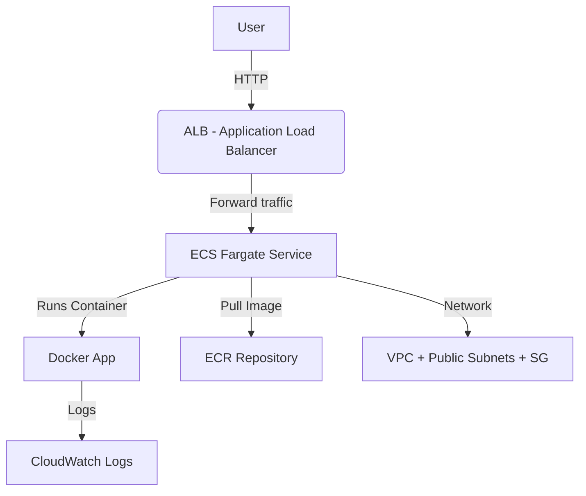

# 🚀 AWS ECS Fargate + ALB Deployment (Terraform)

This project deploys a fully managed **containerized web application** on **AWS ECS Fargate**, fronted by an **Application Load Balancer (ALB)**, with all infrastructure provisioned using **Terraform**.

---

## 🏗️ Architecture Overview

## 📦 Components

| Layer | AWS Service | Description |
|-------|--------------|--------------|
| **Compute** | 🧩 ECS Fargate | Runs containerized application in serverless mode |
| **Networking** | 🌐 VPC, Subnets, IGW, Route Tables | Provides network isolation and internet access |
| **Load Balancing** | ⚖️ Application Load Balancer (ALB) | Routes and balances incoming HTTP traffic |
| **Container Registry** | 📦 ECR (Elastic Container Registry) | Stores Docker images for ECS tasks |
| **Monitoring** | 📊 CloudWatch Logs | Collects and centralizes logs from ECS tasks |
| **Identity & Access** | 🔐 IAM Roles & Policies | Grants ECS permissions to pull images and write logs |

---

## 🧰 Technologies Used

| Category | Tool / Service | Purpose |
|-----------|----------------|----------|
| **Infrastructure** | Terraform | Infrastructure as Code (IaC) to provision AWS resources |
| **Compute** | AWS ECS Fargate | Run Docker containers without managing servers |
| **Networking** | AWS VPC + Subnets + SG | Secure, isolated network for workloads |
| **Load Balancing** | AWS Application Load Balancer | Routes HTTP traffic to ECS tasks |
| **Container Registry** | AWS ECR | Stores and versions Docker images |
| **Monitoring / Logging** | AWS CloudWatch | Tracks application logs and metrics |
| **Access Management** | AWS IAM | Manages permissions for ECS tasks and Terraform |
| **Containerization** | Docker | Packages the app for deployment on ECS |
| **Version Control** | Git & GitHub | Source control and collaboration |
